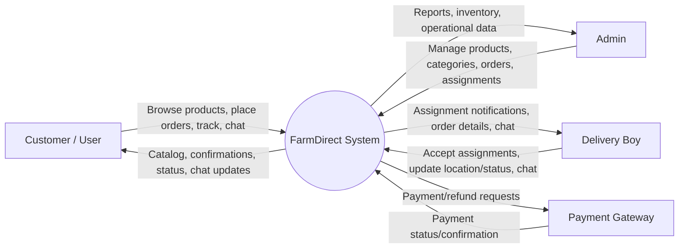
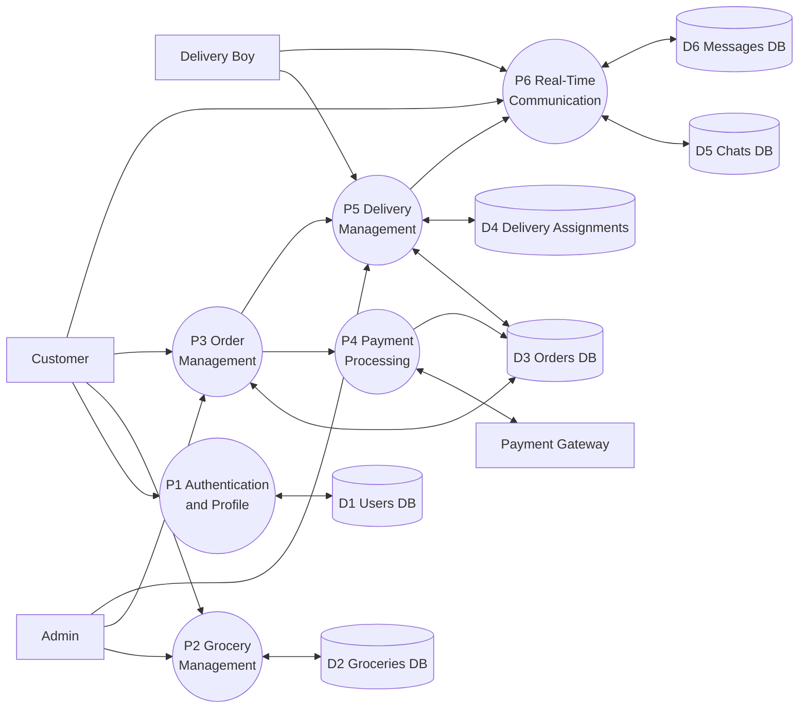
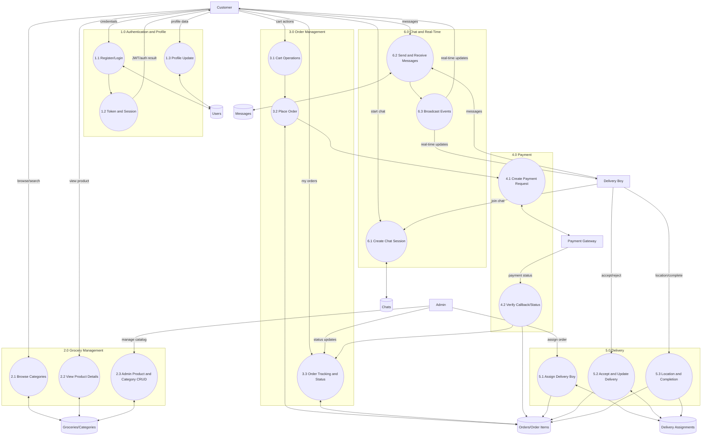

# FarmDirect - Data Flow Diagrams (DFD)

## Level 0 DFD (Context Diagram)

The Level 0 DFD shows the FarmDirect system as a single process and its interaction with external entities.

```
                    ┌─────────────────────────────────────┐
                    │                                     │
                    │      FARMDIRECT SYSTEM              │
                    │                                     │
                    │  E-Commerce Order & Delivery        │
                    │  Management System                  │
                    │                                     │
                    └─────────────────────────────────────┘
                               │         │
                   ────────────┼─────────┼────────────
                   │           │         │           │
                   ▼           ▼         ▼           ▼
              ┌────────┐  ┌────────┐ ┌────────┐ ┌──────────┐
              │Customer│  │ Admin  │ │Delivery│ │ Payment  │
              │ (User) │  │        │ │  Boy   │ │ Gateway  │
              └────────┘  └────────┘ └────────┘ └──────────┘
                   ▲           ▲         ▲           ▲
                   │           │         │           │
                   ────────────┼─────────┼────────────
                               │         │
                    ┌──────────────────────────────┐
                    │   1. Auth & User Data        │
                    │   2. Product Info            │
                    │   3. Order Updates           │
                    │   4. Delivery Status         │
                    │   5. Payment Status          │
                    │   6. Chat Messages           │
                    └──────────────────────────────┘


### Data Flows (Context Level):
1. **Customer → System**: Browse products, Place orders, Manage cart, Track orders, Chat
2. **System → Customer**: Product listings, Order confirmation, Delivery updates, Chat messages
3. **Admin → System**: Manage groceries, View orders, Assign deliveries, View analytics
4. **System → Admin**: Order reports, Delivery reports, Product inventory
5. **Delivery Boy → System**: Accept assignments, Update location, Update order status, Chat
6. **System → Delivery Boy**: Assignment notifications, Route info, Chat messages
7. **System → Payment Gateway**: Payment requests, Refund requests
8. **Payment Gateway → System**: Payment confirmation, Payment status updates

---

## Level 1 DFD (Detailed Process Diagram)

The Level 1 DFD breaks down the system into major processes and shows data flows between them.

```
┌──────────────────────────────────────────────────────────────────────────────────────────┐
│                                                                                          │
│                    FARMDIRECT SYSTEM - LEVEL 1 DFD                                       │
│                                                                                          │
│  ┌─────────────┐     ┌──────────────┐     ┌──────────────┐     ┌──────────────┐        │
│  │  Customer   │     │    Admin     │     │Delivery Boy  │     │   Payment    │        │
│  │   (User)    │     │              │     │              │     │   Gateway    │        │
│  └──────┬──────┘     └──────┬───────┘     └──────┬───────┘     └──────┬───────┘        │
│         │                   │                   │                    │                 │
│         │                   │                   │                    │                 │
│  ┌──────▼─────────────────────────────────────────────────────────────────────┐        │
│  │                                                                             │        │
│  │  D1: Users Database         D2: Groceries DB      D3: Orders DB           │        │
│  │                                                                             │        │
│  └─────────────────────────────────────────────────────────────────────────────┘        │
│                                                                                          │
│  ┌──────────────────────────────────────────────────────────────┐                       │
│  │ P1: USER AUTHENTICATION & PROFILE                            │                      │
│  │ ├─ Login/Register                                            │                      │
│  │ ├─ JWT Token Generation                                      │                      │
│  │ ├─ Email Verification                                        │                      │
│  │ ├─ Update Profile                                            │                      │
│  └──────────────────────────────────────────────────────────────┘                       │
│         ▲                              ▼                                                │
│         │                    ┌─────────────────────┐                                   │
│         │                    │ D1: Users DB        │                                   │
│         │                    │ Stores: Credentials │                                   │
│         │                    │ Role, Profile Info  │                                   │
│         │                    └─────────────────────┘                                   │
│         └────────────────────────────────────────┘                                     │
│                                                                                          │
│  ┌──────────────────────────────────────────────────────────────┐                       │
│  │ P2: GROCERY MANAGEMENT                                        │                      │
│  │ ├─ Browse Products (View by Category)                        │                      │
│  │ ├─ Search Products                                            │                      │
│  │ ├─ View Product Details                                       │                      │
│  │ ├─ Admin: Add/Edit/Delete Products                            │                      │
│  │ ├─ Manage Stock Levels                                        │                      │
│  │ ├─ Manage Categories                                          │                      │
│  └──────────────────────────────────────────────────────────────┘                       │
│         ▲                              ▼                                                │
│         │                    ┌─────────────────────┐                                   │
│         │                    │ D2: Groceries DB    │                                   │
│         │                    │ Stores: Products    │                                   │
│         │                    │ Categories, Stock   │                                   │
│         │                    └─────────────────────┘                                   │
│         └────────────────────────────────────────┘                                     │
│                                                                                          │
│  ┌──────────────────────────────────────────────────────────────┐                       │
│  │ P3: ORDER MANAGEMENT                                          │                      │
│  │ ├─ Add Items to Cart                                          │                      │
│  │ ├─ Update Cart Quantities                                     │                      │
│  │ ├─ Remove Items from Cart                                     │                      │
│  │ ├─ Place Order                                                │                      │
│  │ ├─ View Orders List                                           │                      │
│  │ ├─ View Order Details                                         │                      │
│  │ ├─ Update Order Status (Admin only)                           │                      │
│  │ ├─ Cancel Order                                               │                      │
│  └──────────────────────────────────────────────────────────────┘                       │
│         ▲                              ▼                                                │
│         │                    ┌─────────────────────┐                                   │
│         │                    │ D3: Orders DB       │                                   │
│         │                    │ Stores: Orders      │                                   │
│         │                    │ Order Items, Status │                                   │
│         │                    └─────────────────────┘                                   │
│         └────────────────────────────────────────┘                                     │
│                                                                                          │
│  ┌──────────────────────────────────────────────────────────────┐                       │
│  │ P4: PAYMENT PROCESSING                                        │                      │
│  │ ├─ Generate Payment Token                                     │                      │
│  │ ├─ Process Payment                                            │                      │
│  │ ├─ Handle Payment Confirmation                                │                      │
│  │ ├─ Handle Payment Failure                                     │                      │
│  │ ├─ Process Refunds                                            │                      │
│  │ ├─ Update Payment Status                                      │                      │
│  └──────────────────────────────────────────────────────────────┘                       │
│         ▲                              ▼                                                │
│         │                    ┌─────────────────────┐                                   │
│         │                    │ Payment Gateway     │                                   │
│         │                    │ (External API)      │                                   │
│         │                    └─────────────────────┘                                   │
│         └────────────────────────────────────────┘                                     │
│                                                                                          │
│  ┌──────────────────────────────────────────────────────────────┐                       │
│  │ P5: DELIVERY MANAGEMENT                                       │                      │
│  │ ├─ Create Delivery Assignment                                 │                      │
│  │ ├─ View Assigned Orders (Delivery Boy)                        │                      │
│  │ ├─ Accept/Reject Assignment                                   │                      │
│  │ ├─ Update Order Status                                        │                      │
│  │ ├─ Send Location Updates                                      │                      │
│  │ ├─ Generate OTP for Delivery                                  │                      │
│  │ ├─ Verify OTP & Mark Delivered                                │                      │
│  └──────────────────────────────────────────────────────────────┘                       │
│         ▲                              ▼                                                │
│         │                    ┌─────────────────────┐                                   │
│         │                    │ D3: Orders DB       │                                   │
│         │                    │ D4: Delivery Assign │                                   │
│         │                    │ Location Updates    │                                   │
│         │                    └─────────────────────┘                                   │
│         └────────────────────────────────────────┘                                     │
│                                                                                          │
│  ┌──────────────────────────────────────────────────────────────┐                       │
│  │ P6: REAL-TIME COMMUNICATION (Chat)                            │                      │
│  │ ├─ Create Chat Session                                        │                      │
│  │ ├─ Send Message (User/Delivery Boy)                           │                      │
│  │ ├─ Receive Message                                            │                      │
│  │ ├─ View Chat History                                          │                      │
│  │ ├─ Send Location Data                                         │                      │
│  │ ├─ Real-time Notifications (Socket.io)                        │                      │
│  └──────────────────────────────────────────────────────────────┘                       │
│         ▲                              ▼                                                │
│         │                    ┌─────────────────────┐                                   │
│         │                    │ D5: Chats DB        │                                   │
│         │                    │ D6: Messages DB     │                                   │
│         │                    │ Socket.io Streams   │                                   │
│         │                    └─────────────────────┘                                   │
│         └────────────────────────────────────────┘                                     │
│                                                                                          │
└──────────────────────────────────────────────────────────────────────────────────────────┘
```

---

## Detailed Process Specifications

### **P1: User Authentication & Profile Management**

```
    Customer              P1              D1
       │                  │              │
       │ Username/Email ──→│──────────────→│
       │ Password          │ Verify Creds  │
       │                   │              │
       │←─ JWT Token ──────│←─ Auth Result │
       │                   │              │
       │ Profile Data ────→│──────────────→│
       │                   │ Store Profile │
       │←─ Confirmation ───│              │
       │                   │              │
```

**Inputs:**
- Username, Email, Password
- Profile information

**Processes:**
- Validate credentials against D1
- Hash password using bcryptjs
- Generate JWT token
- Update user profile

**Outputs:**
- JWT Token
- Authentication status
- User profile data

**Data Store:** D1 (Users Database)

---

### **P2: Grocery Management**

```
    Customer              P2              D2              Admin
       │                  │              │               │
       │ Search Query ────→│──────────────→│               │
       │                   │ Query         │               │
       │←─ Product List ───│←─ Results ────│               │
       │                   │              │               │
       │ Filter By        │ Browse, Sort  │               │
       │ Category ────────→│──────────────→│               │
       │                   │              │               │
       │←─ Filtered List ──│←─ Return ────│               │
       │                   │              │ Add Product ──→│
       │                   │              │ Edit Product   │
       │                   │←─ Update ─────│ Delete Product │
       │                   │              │               │
```

**Inputs:**
- Search query
- Category filter
- Product management requests (Admin)

**Processes:**
- Query groceries database
- Filter by category
- Sort and paginate results
- Add/Edit/Delete products (Admin)
- Update stock levels

**Outputs:**
- Product listings
- Product details
- Confirmation of operations

**Data Store:** D2 (Groceries Database)

---

### **P3: Order Management**

```
    Customer              P3              D3              Admin
       │                  │              │               │
       │ Add to Cart ─────→│              │               │
       │ Update Qty       │ Validate      │               │
       │                   │ Quantities    │               │
       │←─ Cart Confirm ───│              │               │
       │                   │              │               │
       │ Place Order ─────→│──────────────→│               │
       │ (Items+Address)   │ Create Order  │               │
       │                   │ Save Items    │               │
       │←─ Order # & Total │←─ Stored ─────│               │
       │                   │              │ View Orders ──→│
       │ View My Orders ───→│──────────────→│ Generate Report
       │                   │ Query by User │               │
       │←─ Orders List ────│←─ Return ─────│               │
       │                   │              │ Update Status ─→
       │ Cancel Order ─────→│──────────────→│ (Confirmed,   │
       │                   │ Update Status │  Cancelled)   │
       │←─ Confirmation ───│←─ Updated ────│               │
       │                   │              │               │
```

**Inputs:**
- Product IDs and quantities
- Delivery address
- Order cancellation requests
- Status updates (Admin)

**Processes:**
- Validate product availability
- Calculate order total
- Create order record
- Create order items
- Update order status
- Handle cancellations

**Outputs:**
- Order confirmation
- Order ID and total amount
- Order list with status
- Order reports (Admin)

**Data Store:** D3 (Orders Database)

---

### **P4: Payment Processing**

```
    Customer              P4         Payment Gateway
       │                  │               │
       │ Order placed ────→│               │
       │                   │ Generate Token│
       │                   │───────────────→
       │                   │ Token Created
       │←─ Payment Link ───│←──────────────│
       │                   │               │
       │ Enter Card Details│ Submit to PG
       │───────────────────────────────────→
       │                   │ Process Payment
       │                   │ (Encrypted)
       │←─ Confirmation ───│←──────────────│
       │                   │ Update D3: Payment Status
       │                   │───────────────→ D3
       │                   │               │
```

**Inputs:**
- Order ID
- Total amount
- Payment method
- Card details (via Payment Gateway)

**Processes:**
- Generate payment token
- Validate payment amount
- Send to payment gateway
- Handle payment response
- Update order payment status
- Trigger refund if needed

**Outputs:**
- Payment confirmation
- Payment status (paid/failed)
- Payment reference ID
- Refund confirmation

**Data Store:** D3 (Orders - Payment Status), External: Payment Gateway

---

### **P5: Delivery Management**

```
    Admin                 P5              D3 & D4         Delivery Boy
       │                  │               │               │
       │ Assign Order ────→│──────────────→│               │
       │                   │ Create Assign │ Assignment    │
       │                   │               │ Notification ─→
       │                   │               │               │
       │                   │←─ Assignment ID               │
       │                   │               │ Accept/Reject │
       │                   │←───────────────────────────────│
       │                   │ Update Status │               │
       │←─ Confirmation ───│─────────────→ │               │
       │                   │               │ Location Update│
       │ Track Order ─────→│──────────────→│←──────────────│
       │                   │ Get Location  │ Send Location │
       │←─ Live Location ──│←──────────────│               │
       │                   │               │ Update Delivery│
       │                   │               │ Mark Delivered│
       │                   │←───────────────────────────────│
       │                   │ Generate OTP  │               │
       │                   │───────────────→ Verify OTP    │
       │ View Report ─────→│◄─ Delivery ID                 │
       │←─ Delivery Report │               │               │
```

**Inputs:**
- Order ID
- Assigned delivery boy ID
- Accept/Reject assignment
- Location coordinates
- OTP verification

**Processes:**
- Create delivery assignment
- Send notification to delivery boy
- Accept/reject assignment
- Track real-time location
- Update delivery status
- Verify OTP for delivery
- Mark order as delivered

**Outputs:**
- Assignment confirmation
- Real-time location
- Delivery status updates
- Delivery completion confirmation
- Delivery reports (Admin)

**Data Store:** D3 (Orders), D4 (Delivery Assignments), Location data stream

---

### **P6: Real-Time Communication (Chat)**

```
    Customer              P6              D5 & D6         Delivery Boy
       │                  │               │               │
       │ Create Chat ─────→│──────────────→│               │
       │                   │ Link Order    │               │
       │                   │───────────────→ Chat Ready    │
       │ Send Message ─────→│──────────────→│──────────────→│
       │ (Socket.io)       │ Store Message │ Real-time     │
       │                   │               │ Notification  │
       │←─ Confirmation ───│               │               │
       │                   │               │ Send Message ─→│
       │←─ Received Msg ───│←──────────────│←──────────────│
       │ (Socket.io)       │ Broadcast     │ (Real-time)  │
       │ View Chat History │               │               │
       │────────────────────→────────────────→←──────────────│
       │←─ Message List ───│               │               │
       │ Send Location ────→│──────────────→│───────────────→│
       │ Update (Delivery) │ Broadcast     │ Location Data  │
       │←─ Delivery Location               │               │
       │                   │               │               │
```

**Inputs:**
- Order ID (to create chat)
- Message content
- Sender ID
- Location coordinates

**Processes:**
- Create chat session for order
- Store messages in database
- Broadcast via Socket.io
- Real-time location updates
- Message history retrieval

**Outputs:**
- Chat confirmation
- Real-time message delivery
- Chat history
- Location updates

**Data Store:** D5 (Chats), D6 (Messages), Socket.io event streams

---

## Data Dictionary

### **D1: Users Database**
| Field | Type | Purpose |
|-------|------|---------|
| user_id | INT | Unique identifier |
| name | VARCHAR | User full name |
| email | VARCHAR | Unique email |
| password_hash | VARCHAR | Bcrypt hashed password |
| role | ENUM | user/admin/deliveryboy |
| phone | VARCHAR | Contact number |
| address | JSON | User address |
| isVerified | BOOLEAN | Email verification status |
| created_at | TIMESTAMP | Account creation time |

### **D2: Groceries Database**
| Field | Type | Purpose |
|-------|------|---------|
| product_id | INT | Unique identifier |
| name | VARCHAR | Product name |
| description | TEXT | Product details |
| price | DECIMAL | Product price |
| image_url | VARCHAR | Product image |
| category_id | INT | Category reference |
| stock | INT | Available quantity |
| created_at | TIMESTAMP | Product creation date |

### **D3: Orders Database**
| Field | Type | Purpose |
|-------|------|---------|
| order_id | INT | Unique identifier |
| user_id | INT | Customer reference |
| status | ENUM | pending/confirmed/delivered/cancelled |
| total | DECIMAL | Order total amount |
| address | JSON | Delivery address |
| payment_status | ENUM | pending/paid/failed |
| delivery_boy_id | INT | Assigned delivery personnel |
| created_at | TIMESTAMP | Order creation time |

### **D4: Delivery Assignments**
| Field | Type | Purpose |
|-------|------|---------|
| assignment_id | INT | Unique identifier |
| order_id | INT | Order reference |
| delivery_boy_id | INT | Delivery personnel |
| status | ENUM | pending/accepted/completed |
| assigned_at | TIMESTAMP | Assignment time |

### **D5: Chats Database**
| Field | Type | Purpose |
|-------|------|---------|
| chat_id | INT | Unique identifier |
| order_id | INT | Order reference |
| user_id | INT | Customer reference |
| delivery_boy_id | INT | Delivery personnel |
| created_at | TIMESTAMP | Chat creation time |

### **D6: Messages Database**
| Field | Type | Purpose |
|-------|------|---------|
| message_id | INT | Unique identifier |
| chat_id | INT | Chat reference |
| sender_id | INT | Message sender |
| receiver_type | ENUM | user/deliveryboy/ai |
| content | TEXT | Message body |
| is_ai_message | BOOLEAN | AI-generated flag |
| timestamp | TIMESTAMP | Message time |

---

## Data Flow Summary Table

| From | To | Data | Purpose |
|------|----|----|---------|
| Customer | P1 | Credentials | Authentication |
| P1 | D1 | Profile Data | Store user info |
| P1 | Customer | JWT Token | Session management |
| Customer | P2 | Search Query | Browse products |
| P2 | D2 | Query | Fetch products |
| D2 | P2 | Product List | Display to user |
| Customer | P3 | Order Data | Place order |
| P3 | D3 | Order Record | Store order |
| Admin | P5 | Assignment | Assign delivery |
| P5 | D3 & D4 | Status Update | Track delivery |
| Customer | P6 | Message | Send chat |
| P6 | D5/D6 | Message Record | Store chat |
| P6 | Customer | Broadcast | Real-time delivery |
| P4 | Payment Gateway | Payment Request | Process payment |
| Payment Gateway | P4 | Payment Status | Confirmation |

---

## System Interactions

### Customer Journey Flow
1. **Register/Login** → P1 (Authentication)
2. **Browse Products** → P2 (Grocery Management)
3. **Add to Cart & Checkout** → P3 (Order Management)
4. **Process Payment** → P4 (Payment Processing)
5. **Track Delivery** → P5 (Delivery Management)
6. **Real-time Chat** → P6 (Communication)

### Admin Operations
1. **Manage Products** → P2 (Add/Edit/Delete)
2. **View Orders** → P3 (Order Reports)
3. **Assign Delivery** → P5 (Create Assignments)

### Delivery Boy Operations
1. **View Assignments** → P5 (List Assigned Orders)
2. **Accept Assignment** → P5 (Update Status)
3. **Update Location** → P5 (Send Coordinates)
4. **Chat with Customer** → P6 (Send Messages)
5. **Mark Delivered** → P5 (Complete Delivery)

---

## External Entities

| Entity | Interaction | Data Exchange |
|--------|-----------|-----------------|
| Payment Gateway | Online Payment Processing | Payment request → Payment confirmation |
| Email Service | User Notifications | Order confirmation, Delivery updates |
| SMS Service | Alerts & OTP | OTP delivery, Status alerts |
| Map Service | Location Tracking | Coordinates, Route optimization |
| Socket.io | Real-time Updates | Chat, Location, Status updates |

---

## Mermaid DFD Structures

The following diagrams provide renderable Mermaid structures for Level 0, Level 1, and Level 2 DFDs.

### Level 0 DFD (Context Diagram) - Mermaid



### Level 1 DFD (Major Processes) - Mermaid



### Level 2 DFD (Detailed Decomposition) - Mermaid



